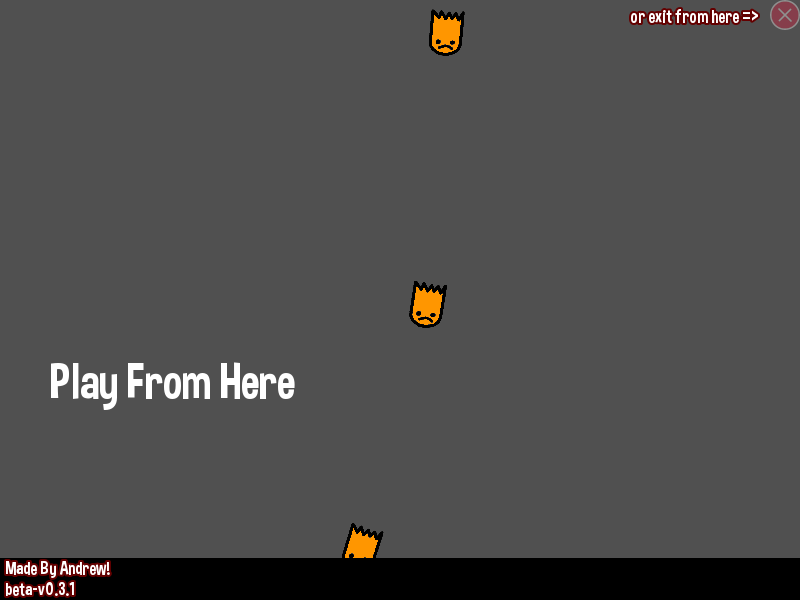

# No Ghosts
No Ghost is a game built using C++ and SFML library in which a good ghost tries to kill other evil ghosts failling from the sky with some powerups and medkits as well tha can heal you

## Running the game
- You need to install SFML library in your IDE: https://www.sfml-dev.org/tutorials/2.5/ (I used CodeBlocks, that's why there is .cbp file in the repo)
- After linking SFML library to your project, you should be able to build main.cpp file
- Make sure that 'fonts', 'textures' and 'sounds' directories are in your project root directory to be able to run the game with no issues.

## Game images

